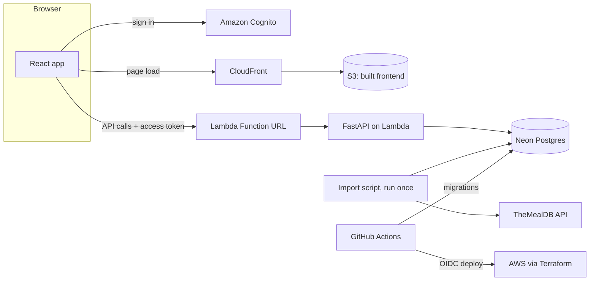

# Scrappy

**What can I actually make with what's in my kitchen right now?**

Scrappy is a desktop web app that ranks recipes by how many of their ingredients you already have. You type in your pantry, and every result tells you exactly what's missing: *"You have 3 of 7 — missing oil, salt, soy sauce, spring onion."*

Most recipe sites start from a recipe and send you shopping. Scrappy works backwards from what you've got.

## Architecture



- The **frontend** is a static React build served from a private S3 bucket through CloudFront.
- The **API** is FastAPI running on AWS Lambda (via Mangum), reached through a Lambda Function URL. It verifies the Cognito access token on every request.
- The **database** is Postgres on Neon's free plan. The recipe catalog is imported from TheMealDB once, so browsing never calls a third-party API. The one runtime exception is Claude, called from the backend for substitutions and recipe generation, on an explicit button press.
- **Everything on AWS is defined in Terraform** and deployed by GitHub Actions on every merge to `main`.

## Tech stack

| Layer | Choice |
|---|---|
| Frontend | React 19, TypeScript (strict), Vite, React Router, TanStack Query 5, Tailwind CSS 4, Headless UI |
| Auth UI | Amplify UI `Authenticator` + `aws-amplify` 6 |
| API | Python 3.13, FastAPI, Pydantic 2, pydantic-settings, Mangum |
| AI features | `anthropic` SDK, Claude Opus 5, backend only, with a hard $5/month spend cap |
| Database | PostgreSQL 17, SQLAlchemy 2, psycopg 3, Alembic |
| Auth | Amazon Cognito, PyJWT |
| Hosting | AWS Lambda, S3, CloudFront, SSM Parameter Store, CloudWatch; Neon Postgres |
| Infrastructure | Terraform |
| CI/CD | GitHub Actions with AWS access via OIDC (no long-lived keys) |
| Tooling | uv, ruff, pytest; Vitest, React Testing Library, MSW; Docker Compose |

## Testing

- **Backend:** pytest against a real Postgres 17 database (Docker locally, a service container in CI). Each test runs in a transaction that's rolled back afterwards.
- **Frontend:** Vitest and React Testing Library, with MSW mocking the API.
- **CI:** every pull request runs lint, format, type checks, tests, and a Terraform validation. Merges to `main` deploy automatically.

## Local setup

**Prerequisites:** macOS or Linux, [Docker Desktop](https://www.docker.com/products/docker-desktop/), and [uv](https://docs.astral.sh/uv/).

```bash
# 1. Start local Postgres 17 on host port 5433 (creates scrappy and scrappy_test)
docker compose up -d

# 2. Install backend dependencies and create a local config file
cd backend
uv sync
cp .env.example .env

# 3. Create the tables
uv run alembic upgrade head

# 4. Import the recipe catalog from TheMealDB (~11s; responses are cached)
uv run python -m scripts.import_mealdb

# 5. Run the API: http://127.0.0.1:8000, interactive docs at /docs
uv run uvicorn app.main:app --reload

# 6. Run tests, lint, and format checks
uv run pytest
uv run ruff check . && uv run ruff format --check .
```

Stop the database with `docker compose down`; its data is kept in a Docker volume.

## License

[MIT](LICENSE)
