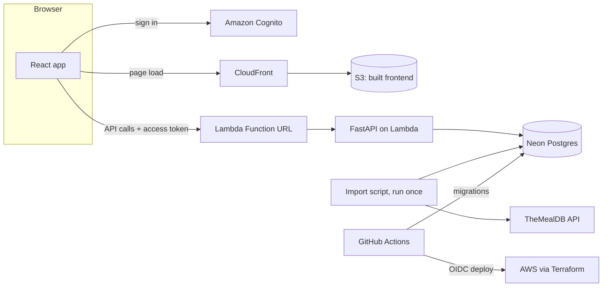

# Scrappy - AI Powered Recipe Generator

**What can I actually make with what's in my kitchen right now?**

Scrappy is a desktop web app that ranks recipes by how many of their ingredients you already have. You type in your pantry, and every result tells you exactly what's missing: *"You have 3 of 7 — missing oil, salt, soy sauce, spring onion."*

Most recipe sites start from a recipe and send you shopping. Scrappy works backwards from what you've got.

## Architecture


```mermaid
flowchart LR
    subgraph Browser
        UI[React app]
    end

    UI -- sign in --> Cognito[Amazon Cognito]
    UI -- page load --> CF[CloudFront] --> S3[(S3: built frontend)]
    UI -- "API calls + access token" --> URL[Lambda Function URL]
    URL --> API[FastAPI on Lambda]
    API --> DB[(Neon Postgres)]

    Import[Import script, run once] --> MealDB[TheMealDB API]
    Import --> DB

    GH[GitHub Actions] -- "OIDC deploy" --> AWS[AWS via Terraform]
    GH -- migrations --> DB
```

- The **frontend** is a static React build served from a private S3 bucket through CloudFront.
- The **API** is FastAPI running on AWS Lambda (via Mangum), reached through a Lambda Function URL. It verifies the Cognito access token on every request.
- The **database** is Postgres on Neon's free plan. The recipe catalog is imported from TheMealDB once, so browsing never calls a third-party API. The one runtime exception is Claude, called from the backend for substitutions and recipe generation, on an explicit button press.
- **Everything on AWS is defined in Terraform** and deployed by GitHub Actions on every merge to `main`.

## Tech stack

| Layer | Choice |
|---|---|
| Frontend | React 19, TypeScript (strict), Vite, React Router, TanStack Query 5, Tailwind CSS 4, Headless UI |
| Auth UI | Amplify UI `Authenticator` + `aws-amplify` 6 |
| API | Python 3.13, FastAPI, Pydantic 2, pydantic-settings, Mangum |
| AI features | `anthropic` SDK, Claude Opus 5, backend only, with a hard $5/month spend cap |
| Database | PostgreSQL 18, SQLAlchemy 2, psycopg 3, Alembic |
| Auth | Amazon Cognito, PyJWT |
| Hosting | AWS Lambda, S3, CloudFront, SSM Parameter Store, CloudWatch; Neon Postgres |
| Infrastructure | Terraform |
| CI/CD | GitHub Actions with AWS access via OIDC (no long-lived keys) |
| Tooling | uv, ruff, pytest; Vitest, React Testing Library, MSW; Docker Compose |

## Testing

**189 tests**, written alongside each feature rather than after it.

| Area | Tests | What they cover |
|---|---:|---|
| Ingredient normalization | 62 | Case, spacing, punctuation, plurals, accents, the `inflect` exceptions, aliases, idempotency |
| TheMealDB import | 16 | Parsing, measure pairing, step numbering, duplicate merging, idempotent re-runs, alias folding |
| Matching | 14 | The worked example from the spec, the 50% floor, assumed staples, per-user visibility of generated recipes |
| Pantry API | 10 | Duplicate adds, unknown IDs, idempotent delete, one user can't touch another's pantry |
| Recipes API | 9 | Detail payload, ingredient order, `owned` flags, 404s |
| Schema | 7 | Unique constraints, cascade deletes, JSON round-trips |
| Auth | 6 | Shared mode, the `shared-user` upsert, production refusing an unauthenticated API |
| Assumed staples | 3 | Water is the only one, and it resolves against the catalog |
| Health and logging | 7 | `/health`, one JSON log line per request, and the safe 500 body |
| Configuration | 7 | DATABASE_URL vs the SSM lookup, read once per cold start, and the Neon engine options |
| **Backend total** | **141** | pytest against a real Postgres 18 database |
| Browser-side filtering | 16 | Quantity stripping, prefix ranking, aliases, "Did you mean…?", assumed staples |
| Recipe pages | 14 | All three paged screens, navigation, links, 404 on every route |
| Pantry editor | 10 | Autocomplete, optimistic removal and rollback, both no-match states |
| Results list | 6 | Have/total counts, missing names, both empty states, error recovery |
| Error boundary | 2 | A crash shows a reload panel instead of a blank page |
| **Frontend total** | **48** | Vitest and React Testing Library, with MSW mocking the API |

**Backend tests run against real Postgres**, not an in-memory stand-in, because the matching
query uses Postgres-specific SQL. Each test runs inside a transaction that is rolled back, so
tests never see each other's rows. **Frontend tests never reach the network:** MSW intercepts
every request, so component tests are fast and deterministic.

**CI** (from M4) runs lint, format, type checks, tests and a Terraform validation on every
pull request. Merges to `main` deploy automatically.

## Local setup

**Prerequisites:** macOS or Linux, [Docker Desktop](https://www.docker.com/products/docker-desktop/), and [uv](https://docs.astral.sh/uv/).

```bash
# 1. Start local Postgres 18 on host port 5433 (creates scrappy and scrappy_test)
docker compose up -d

# 2. Install backend dependencies and create a local config file
cd backend
uv sync
cp .env.example .env

# 3. Create the tables
uv run alembic upgrade head

# 4. Import the recipe catalog from TheMealDB (~11s; responses are cached)
uv run python -m scripts.import_mealdb

# 5. Run the API: http://127.0.0.1:8000, interactive docs at /docs
uv run uvicorn app.main:app --reload

# 6. Run tests, lint, and format checks
uv run pytest
uv run ruff check . && uv run ruff format --check .
```

Then the frontend, in a second terminal:

```bash
cd frontend
npm install --legacy-peer-deps   # see the note below
cp .env.example .env.local

npm run dev        # http://localhost:5173
npm test           # component and unit tests
npm run lint && npm run typecheck && npm run build
```

The `--legacy-peer-deps` flag works around a peer-resolution crash in npm 10.9.2
(`Cannot read properties of null (reading 'edgesOut')`). npm 12 fixes it, and `npm ci`,
which CI uses, is unaffected.

Stop the database with `docker compose down`; its data is kept in a Docker volume.

## License

[MIT](LICENSE)
